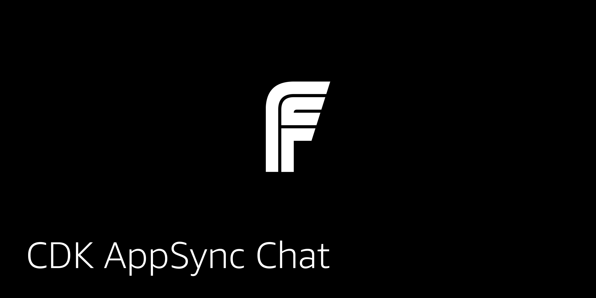

## CDK AppSync Chat

This CDK project deploys an AppSync API, Amazon DynamoDB tables, and an Amazon Cognito User Pool configured to create the infrasstructure for a chat application.

### Deploying the back end

1. Clone the repo

```sh
git clone https://github.com/full-stack-serverless/cdk-appsync-chat.git
```

2. Change into the `cdk-appsync-chat` directory

3. Install dependencies in main folder:

```sh
npm install

# or

yarn
```

3. Deploy to AWS

```sh
cdk deploy
```

Once the project has been deployed, you'll be given the resources needed to configure the client-side React application.

```sh
Outputs:
CdkAppsyncChatStack.UserPoolClientId = 4tojuqrgrctupmj28812nmgi2t
CdkAppsyncChatStack.UserPoolId = us-east-1_vS2Qv9tob
CdkAppsyncChatStack.GraphQLAPIURL = https://w6eiaujspbbcvovbqzn2w4zxhu.appsync-api.us-east-1.amazonaws.com/graphql
  ```

### Deploying the front end

1. Clone the client application

```sh
git clone https://github.com/full-stack-serverless/chat-app.git
```

3. Change into the client directory and install dependencies:

```sh
cd chat-app

npm install

# or

yarn
```

4. Open __src/aws-exports-example.js__ and update with the outputs from CDK.

5. Rename __aws-exports-example.js__ to __aws-exports.js__.

5. Run the app

```sh
npm start
```